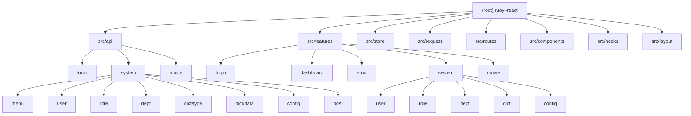

# CLAUDE.md

This file provides guidance to Claude Code (claude.ai/code) when working with code in this repository.

## Project Overview

RuoYi React -- a React-based admin panel frontend for the RuoYi Java backend framework. This is a Vue-to-React port maintaining the same backend API contracts (login, menu routers, dictionary, user info) but using React + TanStack Router.

## Commands

- `pnpm dev` -- start dev server (proxies `/dev-api` to `http://localhost:8080`)
- `pnpm build` -- type-check (`tsc -b`) then production build
- `pnpm lint` -- ESLint
- `pnpm preview` -- preview production build
- No test framework is installed

After modifying code, validate with:
```bash
pnpm tsc --noEmit && pnpm lint && pnpm build
```

## Tech Stack

React 19, TypeScript 6, Vite 8, Ant Design 6, TanStack Router, Zustand 5, Axios, Tailwind CSS 4, pnpm.

`@tanstack/react-query` and `@dnd-kit` are declared dependencies but not yet used in code.

## Architecture

### Dynamic Backend-Driven Routing

The most architecturally significant system. Routes are not all static -- most come from the backend at runtime.

- **Static routes** in `src/routes/index.tsx`: login, root redirect, protected layout (with `requireAuth` guard), dashboard index, error pages (403, 404).
- **Dynamic routes** fetched from `/system/menu/getRouters`. `usePermissionStore` loads `RouterVo[]`, transforms via `buildDynamicRouteConfigs()` in `src/routes/routeTransform.tsx`, then `createDynamicRoutes()` builds TanStack Router route objects.
- **Lazy loading**: Page components loaded via `import.meta.glob('/src/features/**/*.tsx')` + `React.lazy()`. Backend `component` field (e.g. `"system/dict/index"`) maps to `src/features/system/dict/index.tsx`.
- **Special component names**: `"Layout"` -> `AppLayout`, `"ParentView"` -> `ParentView` -- these don't create routes; their children get promoted.
- **Route guards** in `src/routes/guards.ts`: `requireAuth` checks auth and preloads user info + routes; `redirectAuthenticated` sends logged-in users away from login.
- Router is rebuilt dynamically when `dynamicRoutes` changes in the store (see `App.tsx`).

### Adding a New Page

1. Create the page component in `src/features/<module>/<PageName>.tsx`
2. The backend menu `component` field must match the path relative to `src/features/` (e.g. `"system/user/index"` -> `src/features/system/user/index.tsx`)
3. Routes are auto-generated from backend menus -- no manual route registration needed for dynamic pages

### State Management (Zustand)

Five stores in `src/store/`, all with `devtools` middleware:

| Store | Persisted | Purpose |
|---|---|---|
| `useAuthStore` | Yes (token, isAuthenticated) | Login state, user info, roles, permissions |
| `usePermissionStore` | No | Dynamic routes and menu routes from backend |
| `useThemeStore` | Yes | Dark/light mode, primary color |
| `useDictStore` | No | In-memory dictionary cache with dedup |
| `useTagsViewStore` | Yes | Tab navigation state |

Stores call each other directly via `useXxxStore.getState()` (e.g. `logout()` in auth store resets permission and tags stores).

### API / Request Layer

- `src/request/index.ts` exports `request` with `.get()`, `.post()`, `.put()`, `.delete()` methods.
- Features: token injection, AES+RSA request/response encryption, duplicate submit prevention, request cancellation (AbortController), GET response caching, repeat strategies (`reuse`, `cancel-prev`, `ignore-new`, `none`).
- API modules in `src/api/` organized by domain, each with `index.ts` (functions) and `types.ts` (interfaces).
- Response format: `{ code, msg, data, rows?, total? }` typed as `ApiResponse<T>`.
- New API calls: `import request, { type ApiResponse } from '@/request'` then define typed functions.

### Permission System

- `src/utils/permission.ts`: `checkPermission()` and `checkRole()`.
- Wildcard `*:*:*` grants all permissions; `superadmin`/`admin` roles grant all role access.
- `Auth` and `AuthButton` components wrap children with permission checks.

### Layout

Classic admin shell in `src/layout/`: collapsible sidebar (Ant Design `Sider`), header, `TagsView` (browser-like tab navigation with context menu), and content area (`<Outlet />`). `AppLayout` is the protected route component -- all authenticated pages render inside it.

## Module Structure



## Module Index

| Module | Path | Responsibility |
|---|---|---|
| Login API | `src/api/login/` | Login, register, captcha, tenant list, social callback |
| Menu API | `src/api/system/menu/` | Fetch backend route menus |
| User API | `src/api/system/user/` | User CRUD, status change, reset password, import/export |
| Role API | `src/api/system/role/` | Role CRUD, data scope, menu tree, auth user management |
| Dept API | `src/api/system/dept/` | Department CRUD, tree select |
| Dict Type API | `src/api/system/dict/type/` | Dictionary type CRUD, refresh cache |
| Dict Data API | `src/api/system/dict/data/` | Dictionary data CRUD |
| Config API | `src/api/system/config/` | System config CRUD, refresh cache |
| Post API | `src/api/system/post/` | Post dropdown select |
| Movie API | `src/api/movie/` | Custom movie module CRUD |
| Login Page | `src/features/login/` | Login form with captcha, tenant selector, remember me |
| Dashboard | `src/features/dashboard/` | Home page with user info display |
| Error Pages | `src/features/error/` | 403 Forbidden, 404 Not Found |
| User Management | `src/features/system/user/` | User list with dept tree, CRUD, import, reset password |
| Role Management | `src/features/system/role/` | Role list with CRUD, data scope, auth user assignment |
| Dept Management | `src/features/system/dept/` | Department tree with CRUD |
| Dict Management | `src/features/system/dict/` | Dict type list + dict data list (two pages) |
| Config Management | `src/features/system/config/` | System config list with CRUD |
| Movie Management | `src/features/movie/` | Custom movie list with CRUD |
| Auth Store | `src/store/useAuthStore.ts` | Token, user info, roles, permissions, login/logout |
| Permission Store | `src/store/usePermissionStore.ts` | Dynamic routes and menu routes from backend |
| Theme Store | `src/store/useThemeStore.ts` | Dark/light mode, primary color |
| Dict Store | `src/store/useDictStore.ts` | In-memory dictionary cache with dedup |
| TagsView Store | `src/store/useTagsViewStore.ts` | Tab navigation state |
| Request Layer | `src/request/` | Axios wrapper with encryption, caching, cancel, interceptors |
| Routes | `src/routes/` | Static routes, dynamic route transform, guards, utilities |
| BaseListPage | `src/components/BaseListPage/` | Reusable list page with table, query, toolbar, column settings |
| BaseDrawer | `src/components/BaseDrawer/` | Reusable drawer component |
| Auth Components | `src/components/Auth/`, `src/components/AuthButton/` | Permission-based rendering |
| Dict Components | `src/components/DictTag/`, `src/components/DictSelect/` | Dictionary display and selection |
| useTableList | `src/hooks/useTableList.ts` | Unified table list hook with pagination, search, reset |
| useDict | `src/hooks/useDict.ts` | Dictionary loading hook |
| usePermission | `src/hooks/usePermission/index.ts` | Permission and role checking hook |
| Layout | `src/layout/` | AppLayout, Sidebar, Header, TagsView, Breadcrumb, ParentView |

## Path Alias

`@` maps to `./src/` (configured in both `vite.config.ts` and `tsconfig.app.json`).

## Auto-Imports

`unplugin-auto-import` is configured -- these are available without explicit imports:
- React hooks (`useState`, `useEffect`, `useMemo`, `useCallback`, etc.)
- TanStack Router (`useNavigate`, `useParams`, `useSearch`, `useMatch`, `Link`, `Outlet`)
- Zustand `create`

Generated types in `src/types/auto-imports.d.ts`. Do not manually edit that file.

## Code Standards

The project has a custom skill at `.claude/skills/react-ts-standards/SKILL.md` defining TypeScript standards. Key rules:
- Never use `any`, `as any`, `@ts-ignore`, or non-null assertions to suppress errors
- Always trace the source of type errors before fixing
- Never directly consume potentially null/undefined API response fields
- All Props, event params, API params, and store state must have explicit types

The project also has a Vue-to-React migration skill at `.claude/skills/vue-to-react/SKILL.md` for porting RuoYi Vue pages.

## Environment Variables

Defined in `.env.development`:
- `VITE_APP_BASE_API=/dev-api` -- API base path (proxied to backend)
- `VITE_APP_CLIENT_ID` -- OAuth2 client ID
- `VITE_APP_ENCRYPT=false` -- Encryption toggle
- `VITE_APP_RSA_PUBLIC_KEY` / `VITE_APP_RSA_PRIVATE_KEY` -- RSA keys for request/response encryption

## graphify

This project has a knowledge graph at graphify-out/ with god nodes, community structure, and cross-file relationships.

Rules:
- For codebase questions, first run `graphify query "<question>"` when graphify-out/graph.json exists. Use `graphify path "<A>" "<B>"` for relationships and `graphify explain "<concept>"` for focused concepts. These return a scoped subgraph, usually much smaller than GRAPH_REPORT.md or raw grep output.
- If graphify-out/wiki/index.md exists, use it for broad navigation instead of raw source browsing.
- Read graphify-out/GRAPH_REPORT.md only for broad architecture review or when query/path/explain do not surface enough context.
- After modifying code, run `graphify update .` to keep the graph current (AST-only, no API cost).

## Changelog

- 2026-06-04: Initial CLAUDE.md generation. Full project scan completed. 90 source files identified across 6 feature modules, 9 API modules, 5 stores, request layer, routes, layout, and shared components/hooks.
